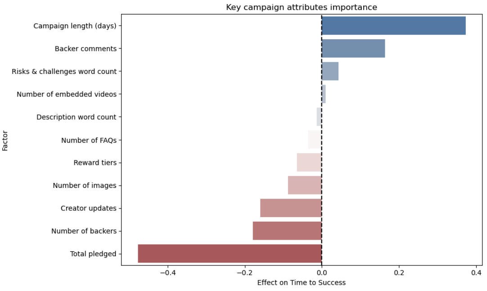

# Analyzing the successful time of kickstarter projects

## Project objective

The objective of the analysis is to indicate the **time to successful time of kickstarter project** and the **factors that affect the successful of the campaigns the most**.

---

## Dataset overview

The data Kickstarter dataset, originally curated by the Virginia Tech DMKD lab. It can be accessed and downloaded from: https://dmkd.cs.vt.edu/projects/survival/data/18k_Projects.csv (raw project data)

- Number of observations: 4175 campaigns
- Number of variables: 56 features
  - 2 survival core fields: **time to success**, **event**
  - 15 category dummies: art, comics, crafts, dance, design, fashion, film & video, food, game, journalism, music, photography, publishing, technology, theater
  - 6 currency dummies: AUD, CAD, EUR, GPB. NZD, USD
  - 27 campaign- and creator-level features
  - 6 network aggregates
 
**Specifying the starting event**: The time‐zero for every campaign is its **launch date** on Kickstarter, when the project first becomes publicly available for backing.

**Determine the elimination (failure) event**: The “event” is defined as the first day the campaign’s pledged amount meets or exceeds its funding goal. Once that threshold is crossed, the campaign is considered “successful” and exits the risk set.

**Determine the time-to-event variable**: 
*day_succ_i = (the calendar date on which project i first reaches its funding goal) – (the calendar date the project was launched)*

**Determine the censoring variable**: 
Status is set to:
- 1 if the project’s pledged total reached or exceeded the goal on or before day 60
- 0 otherwise (i.e. the project closed without ever hitting the goal). Those with Status = 0 are treated as right-censored at their day_succ value.

---

## Key insights

### Insight from Kaplan Meier estimator

- The blue line shows the "survival function", or the percentage of campaigns that did not reach their goals.
- The analysis was conducted over 2 months (60 days), the Kaplan Meier method showed that during this period, nearly 70% of the campaigns achieved their goals.

### Key factors that affect the result

**Category**

- Publishing has the strongest delaying effect on the time to campaign success, indicating that campaigns in this category take significantly longer to succeed. This result is highly statistically significant (p ≈ 0).
- Journalism and Dance also have relatively high coefficients, implying slower success in those categories.
- Other categories such as Crafts, Film & Video, Music, Technology, and Art have coefficients above 1.0, indicating a slower-than-average time to success.
- In contrast, categories like Photography, Games, and Comics have lower coefficients, suggesting these campaigns reach success more quickly.

**Currency**

- All currencies (AUD, CAD, EUR, GBP, NZD, USD) have strong positive coefficients (>2.5) with very significant p-values (essentially zero).
- USD (curr6) has the highest coefficient at 4.03, indicating that campaigns using USD take significantly longer to succeed compared to those using other currencies.
- Other currencies such as NZD, GBP, EUR, AUD, and CAD also have high coefficients, suggesting they also slow down campaign success time, but to a lesser extent than USD.
- In short, campaigns priced in USD tend to be the slowest to succeed, followed by NZD and GBP.
- This could reflect higher competition or expectations in markets where USD is the primary currency.

**Core campaign statistics**

- It is clear that **funding target is the biggest factor influencing campaign success time**. This is relatively obvious as the larger the project target, the longer the campaign takes to complete the target.

- The chart above pulls out the funding target to get a clearer view of the remaining factors.
- Variables with positive coefficients (**increase time to success**):
  - duration: Longer campaigns naturally take more time to reach success.
  - comments: A high number of comments might indicate confusion or disagreement, which can delay support.
  - words_risks_and_challenges: Overemphasis on risks may reduce supporter confidence, slowing down the campaign.
  - videos: The presence of videos shows a minor delay, possibly due to ineffectiveness or unclear content.

- Variables with negative coefficients (**accelerate time to success**):
  - pledged: Higher total funding suggests project credibility, helping it reach success faster.
  - backers: A large number of backers creates momentum and social proof, speeding up the process.
  - updates: Regular updates build trust and reassure backers, encouraging quicker participation.
  - images: More images help explain the project clearly, attracting quicker support.
  - rewards: A variety of reward tiers makes the project more appealing to different audiences.
  - faqs: Addressing common questions removes uncertainty, helping supporters decide faster.
  - words_description: Clear and complete descriptions improve understanding and reduce hesitation.
